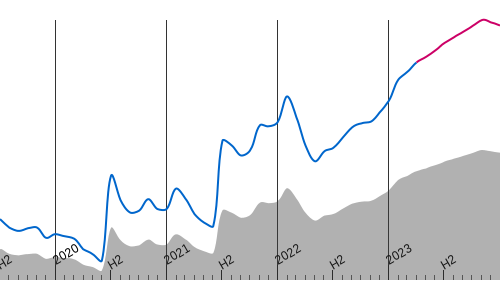

# Smooth line graph

A React library for rendering line graphs, based on SVG.

## Usage

Two React components are exported from this module: `LineGraph` and `TimeGraph`.

A basic dot-to-dot graph can be achieved as follows:

```js
import React from 'react';
import { render } from 'react-dom';
import { LineGraph } from 'smooth-line-graph';

const props = {
    name: 'simple',
    width: 300,
    height: 300,
    lines: [
        {
            key: 'mykey',
            data: [[0, 0], [1, 1], [2, 4], [3, 9], [4, 16], [5, 25], [6, 36], [7, 49]],
            color: 'black'
        }
    ]
};

render(<LineGraph {...props} />, document.getElementById('root'));
```

This results in the following SVG being rendered:


More complicated examples can be found in the `examples` directory.

## Options

Properties passed direct to `<LineGraph />` are the following:

- (**required**) `name`: the class name of the graph
- (**required**) `width`: the displayed width (in pixels) of the graph
- (**required**) `height`: the displayed height (in pixels) of the graph
- (**required**) `lines`: an array of line objects (see [line options](#line-options))
- (**optional**) `beforeLines`: a React component to render *inside* the SVG and *before* the rendered lines
- (**optional**) `afterLines`: a React component to render *inside* the SVG and *after* the rendered lines
- (**optional**) `beforeGraph`: a React component to render *before* the SVG
- (**optional**) `afterGraph`: a React component to render *after* the SVG
- (**optional**) `minX`: minimum X value in scale (this will be calculated from the data otherwise)
- (**optional**) `maxX`: maximum X value in scale (this will be calculated from the data otherwise)
- (**optional**) `minY`: minimum Y value in scale (this will be calculated from the data otherwise)
- (**optional**) `maxY`: maximum Y value in scale (this will be calculated from the data otherwise)
- (**optional**) `outerProperties`: an object containing additional properties to pass to the outer `<div />`
- (**optional**) `svgProperties`: an object containing additional properties to pass to the `<svg />`
- (**optional**) `svgClasses`: a string to render as a class name on the `<svg />`

Note that all of the above `props` are passed into each `outerProperties` and `svgProperties` item, so you could do something like this:

```js
<LineGraph {...props} outerProperties={{ myProp: ({ width }) => `Graph width: ${width}px` }} />
```

Also note that all of the above `props`, plus the following additional ones, are passed to `beforeLines`, `afterLines`, `beforeGraph` and `afterGraph`, and that they are guaranteed to receive `minX`, `maxX`, `minY` and `maxY`:

- `pixX`: a function mapping X values to their corresponding rendered position
- `pixY`: a function mapping Y values to their corresponding rendered position
- `valX`: a function mapping X pixels to their corresponding value
- `valY`: a function mapping Y pixels to their corresponding value

### Line options

The `lines` prop passed to `<LineGraph />` or `<TimeGraph />` should be an array of objects, defining each line. The following list of options can be used as properties on each line object:

- (**required**) `key`: a unique key to identify this line
- (**required**) `data`: an array of points (which are two-length arrays like [xValue, yValue])
- (**required**) `color`: either:
    - a string (e.g. `black` or `#073199`), or
    - a function like `([xValue, yValue], index) => color`, where:
        - `index` is the index of the point we are currently drawing a line from
        - `xValue` is its X value
        - `yValue` is its Y value
        - `color` is a string like `black` or `#073199`

        This determines a line which can change colour dynamically, based on the position and values of its data.
- (**optional**) `strokeWidth`: the number of pixels wide the line should be
- (**optional**) `fill`: (boolean) whether or not to fill the line from 0 (useful mostly on time series)
- (**optional**) `smooth`: (boolean) whether or not to render the line as a smoothed cubic bezier curve
- (**optional**) `arrows`: (boolean) whether or not to draw the line as a list of arrows (useful mostly on time series - see the `arrows` example to see this in action)

### Time graph

Using the `<TimeGraph />` component with the same props as with `<LineGraph />` plus an additional `startTime` prop, will render a time series with a horizontal time axis.

Note that `startTime` and all the X-series values for the lines should be UNIX timestamps (i.e. the number of seconds since the UNIX epoch).

You can find an example of a time series graph in `examples/time.js`, which renders the following:



